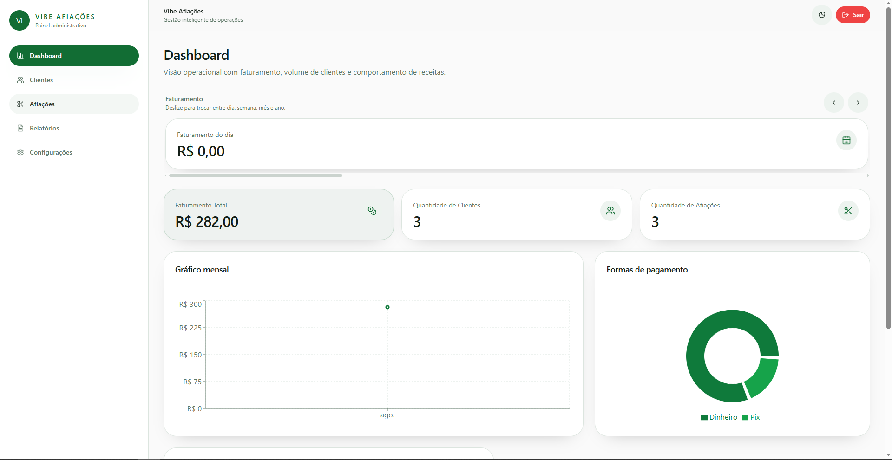
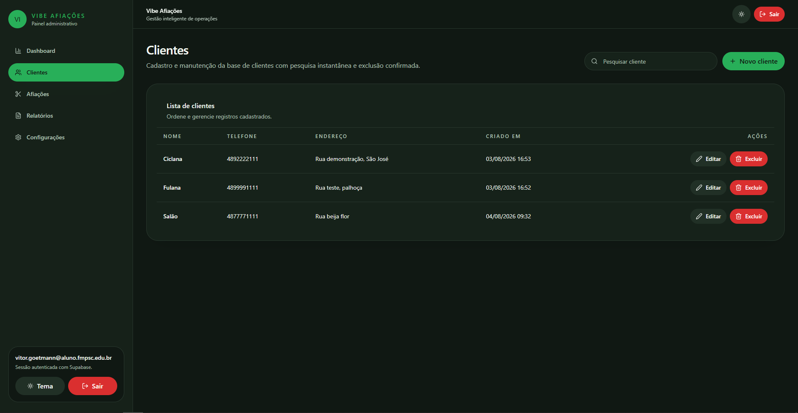
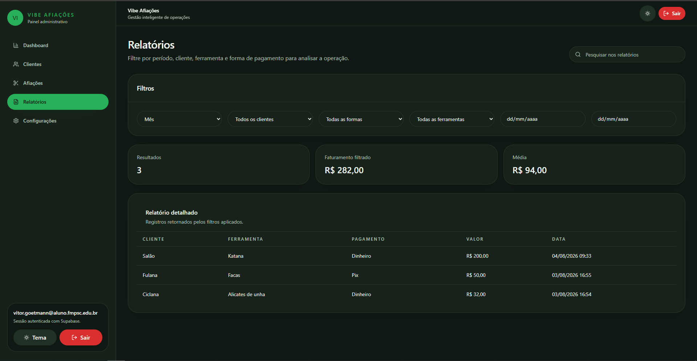

# Gestão Afiador
Solução de interface para gerenciamento de serviços de afiação, clientes e controle de métricas.

## Contexto
Este projeto foi desenvolvido para substituir controles manuais e planilhas em oficinas de afiação, oferecendo uma plataforma web para cadastro estruturado de clientes, acompanhamento do histórico de serviços (afiações) e análise de indicadores operacionais e financeiros em tempo real.

## Arquitetura e Tecnologias
* **React e TypeScript**: Construção de interface de usuário estruturada com tipagem estática, garantindo manutenção segura do código.
* **Vite**: Build tool responsável pelo ambiente de desenvolvimento ágil e empacotamento otimizado.
* **Tailwind CSS**: Estilização baseada em utilitários para consistência de design e responsividade.
* **Supabase**: Provedor de Backend as a Service (BaaS) responsável pela persistência de dados relacionais e gerenciamento de sessões.
* **TanStack Query (React Query)**: Camada de gerenciamento de estado assíncrono e cache de dados.
* **Recharts**: Biblioteca para renderização de gráficos operacionais no painel de controle.

## Diferenciais
* **Gestão de Estado Otimizada**: Integração do React Query para reduzir requisições redundantes ao Supabase e proporcionar navegação fluida.
* **Segurança e Validação**: Uso do Zod e React Hook Form para validação estrita de dados na entrada, prevenindo inconsistências no banco de dados.
* **Responsividade Híbrida**: Layout adaptável para uso tanto em terminais fixos (desktop) quanto em dispositivos móveis no chão de fábrica.

## Status do Projeto
Em desenvolvimento (MVP).

## Telas do Sistema

### Dashboard



### Gestão de Clientes



### Ordens de Serviço e Relatórios



## Licença
Este projeto possui direitos reservados ao seu autor.

## Início Rápido
```bash
npm install
cp .env.example .env
npm run dev
```
